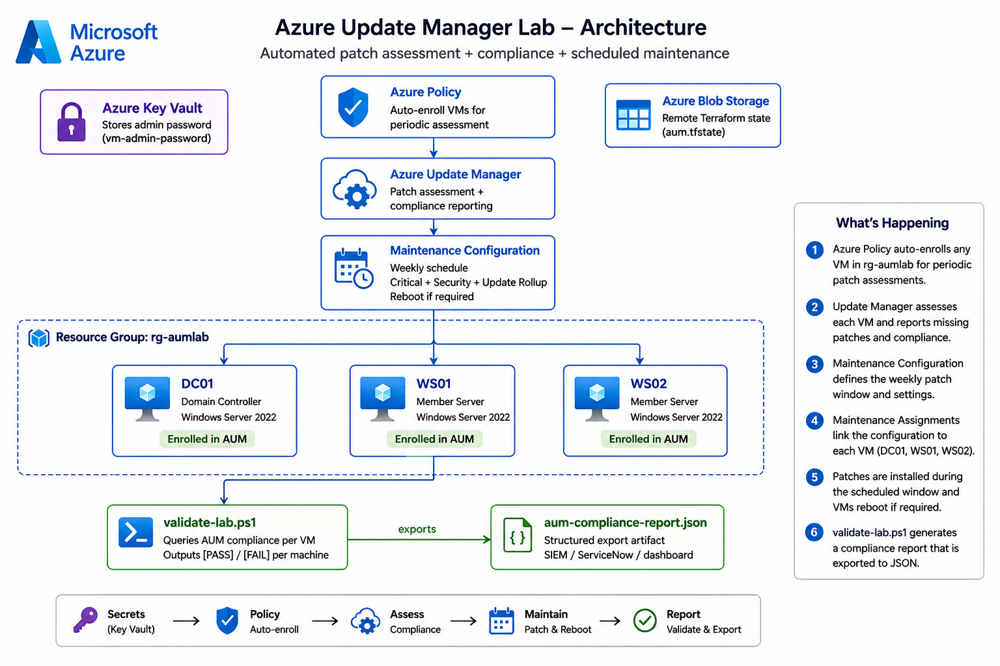
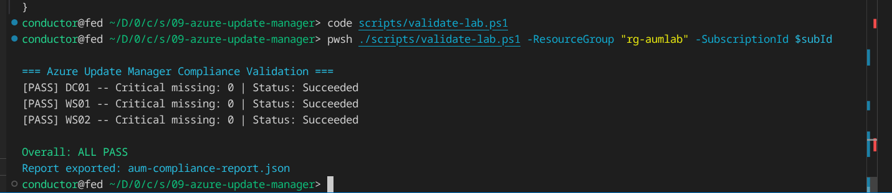
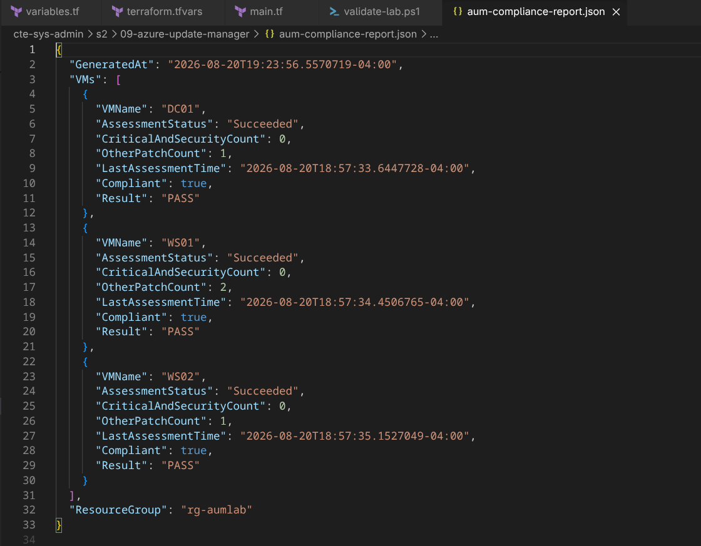
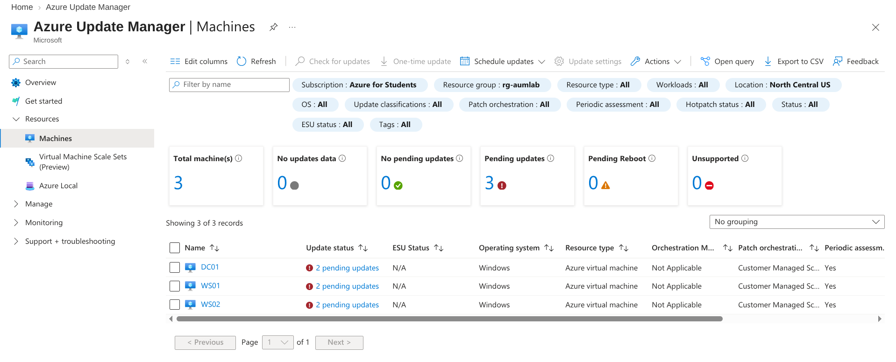
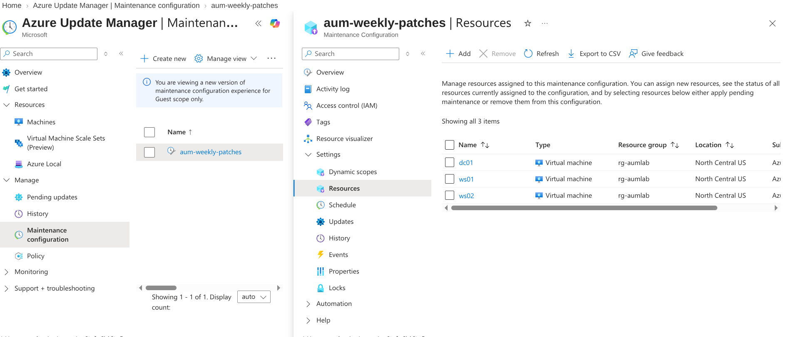
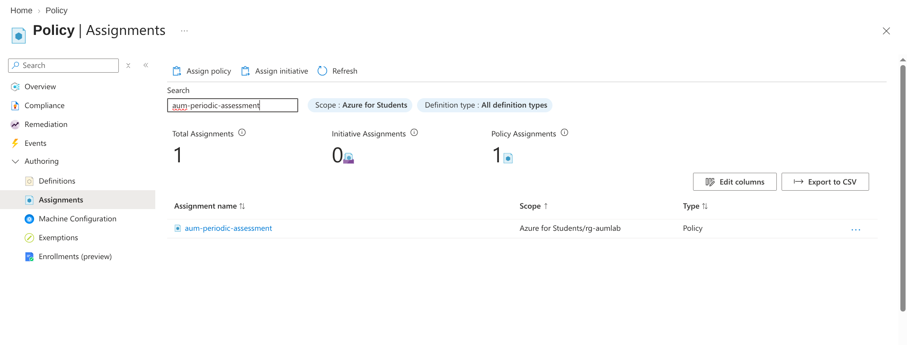

# Azure Update Manager Lab

Automated patch assessment, compliance reporting, and scheduled maintenance for a small Windows Server environment, using Terraform, Powershell and Azure Update Manager. 

## The Business Problem

Unpatched servers are one of the most common root causes of security incidents. Knowing which machines are missing which patches, enforcing a consistent patch schedule, and producing proof of compliance is a core responsibility for any team running Windows infrastructure.

Azure Update Manager is the cloud-native answer to this. It works without an agent on Azure VMs, integrates with Azure Policy for automatic enrollment, tracks a compliance record per machine, and supports both scheduled and on-demand patching.

This lab builds the patch management workflow: infrastructure, policy-based assessment, a scheduled maintenance window, on-demand assessment, patch installation, and compliance reporting.

## Architecture



Azure Policy auto-enrolls every VM in the resource group into periodic patch assessment. A Maintenance Configuration defines the weekly patch window and which update classifications get installed. Three Maintenance Assignments link that schedule to each individual VM. `validate-lab.ps1` queries compliance state per machine and exports the results to a structured JSON report.

## What This Deploys

| Component | Details |
| --- | --- |
| DC01 | Domain controller, Windows Server 2022 |
| WS01, WS02 | Member servers, Windows Server 2022, joined to the domain |
| Domain | `polar.city` |
| Resource group | `rg-aumlab` |
| Region | `northcentralus` |
| Networking | VNet, subnet, NSG restricted to a single IP for RDP |
| Key Vault | RBAC-enabled, stores the VM admin password |
| Update Manager | Policy assignment, weekly Maintenance Configuration, three Maintenance Assignments |

## How It Works

A VM lands in `rg-aumlab`. Azure Policy enrolls it for periodic assessment. That assessment reports which patches are missing. A Maintenance Assignment links the VM to the weekly schedule, so the Maintenance Configuration installs the missing Critical, Security, and Update Rollup patches during the defined window, rebooting only if required.

Assessment and patching are two separate operations. A VM can be assessed and show compliance data without ever receiving an automated patch unless it's also linked to a maintenance window. Both pieces are required for a machine to be fully covered.

## Validation

`validate-lab.ps1` queries Azure for each VM's patch assessment result, prints a pass/fail summary to the terminal, and exports the same data as JSON.





The JSON export exists because a compliance program needs more than something a person can read on a screen. This is the kind of artifact that gets ingested by a SIEM, attached to a ticket, or archived for an audit trail.

## Portal Verification

Three checks confirm the deployment matches what Terraform built.

**Update Manager → Machines.** All three VMs enrolled, periodic assessment active.



**Maintenance Configuration → Resources.** All three VMs linked to `aum-weekly-patches`.



**Policy → Assignments.** The auto-enrollment policy applied at the `rg-aumlab` scope.



## Troubleshooting

| Problem | Cause | Fix |
| --- | --- | --- |
| Maintenance Assignment returns patch orchestration error | VM patch mode isn't compatible with user-scheduled maintenance | Set patch_mode = "AutomaticByPlatform" and enable bypass of platform safety checks for user schedules |
| Provider registration error during apply | `Microsoft.Maintenance` or `Microsoft.GuestConfiguration` not registered | Run `az provider show` for each namespace, wait until Registered, re-apply |
| 403 on Key Vault secret during apply | RBAC role assignment hasn't propagated yet | Re-run `terraform apply`, it resumes from the failed resource |
| DC01 extension fails or times out | AD promotion failure or transient Azure timeout | Re-run `terraform apply`, check Portal → DC01 → Extensions for the real error |
| WS01/WS02 domain join fails | DNS resolves before AD services are fully ready | Re-run `terraform apply`, the join script retries with a bounded wait |
| `validate-lab.ps1` shows `Status: null` | Assessment was triggered but hasn't completed yet | Wait 5-10 minutes, re-run |
| `start_date_time` error during plan | The date in `modules/update-manager/main.tf` is in the past | Update to a future date, re-run plan |

## Teardown

```
terraform destroy
```

Confirm the resource group is gone:

```
az group show --name rg-aumlab
```

Expected result: `ResourceGroupNotFound`.